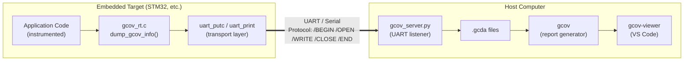

# Embedded Gcov

**An implementable library for filesystem-free gcov code coverage on bare-metal and embedded systems.**

This project collects code coverage data (line coverage, branch coverage, and MC/DC) on microcontrollers running without a filesystem or operating system, and transmits the data to a host computer over UART (or any byte-stream transport).


### Supported Coverage Types

| Coverage Type | Description |
|---|---|
| **Line Coverage** | How many times each source line was executed |
| **Branch Coverage** | Whether each `if`/`else`/`switch` branch was taken |
| **MC/DC Coverage** | Whether each condition independently affects the decision outcome |

## Architectural Overview

The project consists of three main components:

### 1. `gcov_embedded_lib` — Embedded C Library

A portable C library running on the embedded target:

- Scans the coverage structures (`struct gcov_info`) placed by GCC in the `.gcov_info` section.
- Generates binary `.gcda` data using `__gcov_info_to_gcda()`.
- Sends data to the host through user-implemented transport functions (`uart_putc`, `uart_print`).
- Provides stubs for libc functions that require a filesystem (`malloc`, `fopen`, `fprintf`, etc.).

### 2. `gcov-viewer` — VS Code Extension

A VS Code editor extension that visually presents `.c.gcov` files.

You can access the project from: https://github.com/abdulkadrtr/gcov_viewer

### 3. `example_project` — STM32 Example Project

A working example for STM32F103 (Cortex-M3) demonstrating the complete workflow. Shows end-to-end how to collect coverage data over UART, transfer it to the host, and generate reports.

### Data Flow Diagram



## Communication Protocol

Communication between the embedded target and the host takes place over a simple text-based command protocol. Each command begins with a `/` character and ends with a newline (`\n`). Binary data blocks are sent immediately following the command.

### Protocol Commands

| Command | Format | Description |
|---|---|---|
| `/BEGIN` | `/BEGIN\n` | Signals the start of a coverage dump session. All previous state is reset. |
| `/OPEN` | `/OPEN <fid> <file_path>\n` | Opens a new `.gcda` file. `fid` is the file identifier (starts at 0). |
| `/WRITE` | `/WRITE <fid> <offset> <length>\n<binary_data>` | Sends a binary data block. Immediately after the command line, `length` raw bytes follow. |
| `/CLOSE` | `/CLOSE <fid>\n` | Signals that file writing is complete. |
| `/END` | `/END\n` | Signals that the entire coverage dump session is complete. The host writes files to disk. |
| `/ERROR` | `/ERROR <message>\n` | Signals that an error occurred on the device side (e.g., memory pool overflow). |

### Example Session Flow

```
[*] /dev/ttyUSB0  baud=9600  timeout=30s  output=. — listening.
[*] GCOV dump started
[+] OPEN   fid=0  path=/home/abd/Desktop/gcov_embedded/build/main.gcda
    WRITE  fid=0  offset=0  len=256
    WRITE  fid=0  offset=256  len=256
    WRITE  fid=0  offset=512  len=100
[+] CLOSE  fid=0
[+] OPEN   fid=1  path=/home/abd/Desktop/gcov_embedded/build/test.gcda
    WRITE  fid=1  offset=0  len=104
[+] CLOSE  fid=1
[*] GCOV dump completed.
[+] Saved: /home/abd/Desktop/gcov_embedded/build/main.gcda  (612 bytes)
[+] Saved: /home/abd/Desktop/gcov_embedded/build/test.gcda  (104 bytes)
```

## Requirements

| Component | Minimum Version | Purpose |
|---|---|---|
| **GCC** | 14.2 | MC/DC condition coverage support (`-fcondition-coverage`) |
| **Make** | — | For building the example project |

## Quick Start

The following steps demonstrate a complete coverage workflow using the included `example_project`.

### 1. Set the Toolchain Path

Make sure `arm-none-eabi-gcc` is available in your `PATH`.

```bash
# Download from https://developer.arm.com/downloads/-/arm-gnu-toolchain-downloads
# Then add to PATH:
export PATH="/path/to/arm-gnu-toolchain/bin:$PATH"
```

Verify the installation:
```bash
arm-none-eabi-gcc --version
```

> **Note:** GCC 14.2 or newer is required for MC/DC coverage support (`-fcondition-coverage`).

### 2. Build the Project

```bash
make clean
make all
```

This step generates `firmware.elf` and `firmware.bin` in the `build/` directory.

### 3. Flash the Firmware

```bash
make flash
```

Or use your own programming method to flash `build/firmware.bin` to the target.

### 4. Start the Host Server

Start the host server **before** the firmware begins running:

```bash
python gcov_embedded_lib/host/gcov_server.py --port /dev/ttyUSB0 --baud 9600
```

The server begins listening for coverage data arriving over UART. When the firmware runs and `dump_gcov_info()` is called, `.gcda` files are generated automatically.

### 5. Generate Coverage Reports

```bash
make gcov
```

This command runs the `gcov` tool and moves the `.c.gcov` report files into the `coverage_result/` directory.

### 6. View Results

**In VS Code:**
Install the `gcov-viewer` extension and open a `.c.gcov` file in VS Code. The visual coverage report is displayed automatically.

## Integration Guide

Follow the steps below to integrate the `gcov_embedded_lib` library into your own project.

### Step 1: Copy the Library Into Your Project

Copy the `gcov_embedded_lib/` directory to the root of your project:

```
your_project/
├── gcov_embedded_lib/
│   ├── include/
│   │   ├── gcov_rt.h
│   │   └── gcov_transport.h
│   ├── src/
│   │   ├── gcov_rt.c
│   │   └── libc_stubs.c
│   ├── host/
│   │   └── gcov_server.py
│   └── ld/
│       └── gcov_linker.ld.inc
├── src/
│   └── main.c
├── startup.c
├── linker.ld
└── Makefile
```

### Step 2: Implement the Transport Functions

Implement the two functions declared in the `gcov_transport.h` header file in a way that suits your hardware:

```c
#include "gcov_transport.h"

/* Sends a single character */
void uart_putc(char c) {
    while (!(USART_SR & (1 << 7)));
    USART_DR = (uint32_t)c;
}

/* Sends a null-terminated string */
void uart_print(const char *s) {
    while (*s) uart_putc(*s++);
}
```

### Step 3: Configure Your Makefile

Add the following to your existing Makefile:

```makefile
# === gcov_embedded_lib integration ===

KIT_DIR = gcov_embedded_lib

# Library source files (compiled WITHOUT coverage)
KIT_SRCS = $(KIT_DIR)/src/gcov_rt.c \
           $(KIT_DIR)/src/libc_stubs.c

# Include path
CFLAGS_BASE += -I$(KIT_DIR)/include

# Your source files to be instrumented with coverage
GCOV_SRCS = src/main.c \
            src/module_a.c \
            src/module_b.c

# Coverage compiler flags
CFLAGS_GCOV = $(CFLAGS_BASE) \
              -fprofile-arcs -ftest-coverage \
              -fprofile-info-section \
              -fcondition-coverage \
              -fno-inline

# Link libgcov and libgcc
LIBGCOV = $(shell $(CC) $(CFLAGS_BASE) -print-file-name=libgcov.a)
LIBGCC  = $(shell $(CC) $(CFLAGS_BASE) -print-libgcc-file-name)

# Library objects (compiled without coverage)
$(BUILD_DIR)/kit_%.o: $(KIT_DIR)/src/%.c
	$(CC) $(CFLAGS_BASE) -c $< -o $@

# Compilation rule for coverage-instrumented files
define compile_gcov
$(BUILD_DIR)/$(notdir $(basename $(1))).o: $(1)
	$(CC) $(CFLAGS_GCOV) -c $$< -o $$@
endef
$(foreach src,$(GCOV_SRCS),$(eval $(call compile_gcov,$(src))))

# Link rule — libgcov and libgcc are added
$(BUILD_DIR)/firmware.elf: $(KIT_OBJS) $(APP_OBJS)
	$(CC) $(CFLAGS_BASE) $(LDFLAGS) -o $@ $^ $(LIBGCOV) $(LIBGCC)

# Coverage report generation
gcov:
	mkdir -p coverage_result
	$(GCOV) -b -c -g --object-directory $(BUILD_DIR) $(GCOV_SRCS)
	mv *.gcov coverage_result/ 2>/dev/null || true
```

### Step 4: Update Your Linker Script

Include the `gcov_linker.ld.inc` file in the `SECTIONS` block of your linker script. This file defines the `.gcov_info` section, which places gcov info structures in FLASH:

```ld
SECTIONS {
    .text : {
        KEEP(*(.isr_vector))
        *(.text*)
        *(.rodata*)
    } > FLASH

    /* gcov info section — placed in FLASH region */
    INCLUDE gcov_embedded_lib/ld/gcov_linker.ld.inc

    .init_array : {
        __init_array_start = .;
        KEEP(*(.init_array*))
        __init_array_end = .;
    } > FLASH

    /* ... other sections ... */
}
```

This section collects pointers to the `struct gcov_info` structures generated by the compiler with the `-fprofile-info-section` flag. The `dump_gcov_info()` function scans this range (`__gcov_info_start` – `__gcov_info_end`) to access the coverage data of all instrumented files.

### Step 5: Trigger the Coverage Dump

After running your test scenarios in the application, call `dump_gcov_info()`:

```c
#include "gcov_rt.h"

int main(void) {
    uart_init();

    /* Run your application test scenarios */
    test_scenario_1();
    test_scenario_2();
    test_scenario_3();

    /* Send coverage data to the host */
    dump_gcov_info();

    while (1) {
        /* ... */
    }
}
```

### Step 6: Flash the Firmware to the Target

Flash and run the generated `firmware.elf` or `firmware.bin` to the target using your own programming tool (OpenOCD, ST-Link, J-Link, etc.).

### Step 7: Receive Data with the Host Server

Run the `gcov_server.py` script on the host computer:

The script parses the incoming data over UART and generates the `.gcda` files.

### Step 8: Generate Reports with `gcov`

```bash
arm-none-eabi-gcov -b -c -g --object-directory build/ src/main.c src/module_a.c
```

| Flag | Description |
|---|---|
| `-b` | Writes branch coverage information |
| `-c` | Shows branch counts as numbers instead of percentages |
| `-g` | Writes MC/DC condition coverage information |
| `--object-directory` | Directory containing `.gcno` and `.gcda` files |

### Step 9: Visualize in VS Code

1. Install the `gcov-viewer` extension in VS Code.
2. Open the generated `.c.gcov` file in VS Code.
3. The visual report is displayed automatically: line colors, branch points, MC/DC tooltips.

---

## Project Structure

```
gcov_package/
│
├── Makefile                          # Main build and report generation file
│
├── gcov_embedded_lib/                # Embedded C library
│   ├── include/
│   │   ├── gcov_rt.h                 # dump_gcov_info() interface
│   │   └── gcov_transport.h          # uart_putc / uart_print interface
│   ├── src/
│   │   ├── gcov_rt.c                 # Coverage data collection and transmission logic
│   │   └── libc_stubs.c              # File I/O and libc stub functions
│   ├── host/
│   │   └── gcov_server.py            # Host-side UART receiver / .gcda generator
│   └── ld/
│       └── gcov_linker.ld.inc        # .gcov_info section definition (linker fragment)
│
├── example_project/                  # STM32F103 example project
│   ├── main.c                        # Application code + transport implementation
│   ├── test.c                        # MC/DC test functions
│   ├── test.h                        # Test functions header file
│   ├── startup.c                     # Reset handler + .init_array initialization
│   └── stm32.ld                      # Linker script          
│
└── coverage_result/                  # Generated .gcov report files (make gcov)
```
