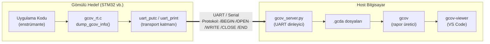

# Embedded Gcov

**Bare-metal ve gömülü sistemler için dosya sistemi gerektirmeyen gcov kod kapsama (code coverage) için implemente edilebilir kütüphane.**

Bu proje, dosya sistemi ve işletim sistemi olmadan çalışan mikrodenetleyicilerde kod kapsama (satır kapsama, dal kapsama ve MC/DC) verisi
toplar ve veriyi UART (veya herhangi bir byte-stream transport) üzerinden host bilgisayara aktarır.

### Desteklenen Kapsama Türleri

| Kapsama Türü | Açıklama |
|---|---|
| **Satır Kapsama** | Her kaynak satırının kaç kez çalıştırıldığı |
| **Dal Kapsama** | Her `if`/`else`/`switch` dalının alınıp alınmadığı |
| **MC/DC Kapsama** | Her koşulun karar sonucunu bağımsız olarak etkileyip etkilemediği |

## Mimari Genel Bakış

Proje üç ana bileşenden oluşur:

### 1. `gcov_embedded_lib` — Gömülü C Kütüphanesi

Gömülü hedefte çalışan taşınabilir C kütüphanesi:

- GCC'nin `.gcov_info` section'ına yerleştirdiği coverage yapılarını (struct gcov_info) tarar.
- `__gcov_info_to_gcda()` ile binary `.gcda` verisini oluşturur.
- Kullanıcının implement ettiği transport fonksiyonları (`uart_putc`, `uart_print`) aracılığıyla veriyi host'a gönderir.
- Dosya sistemi gerektiren libc fonksiyonlarının stub'larını sağlar (`malloc`, `fopen`, `fprintf` vb.).

### 2. `gcov-viewer` — VS Code Eklentisi

`.c.gcov` dosyalarını görsel olarak sunan bir VS Code Editor eklentisidir.

### 3. `example_project` — STM32 Örnek Projesi

Tüm iş akışını gösteren, STM32F103 (Cortex-M3) için çalışan bir örnek. UART üzerinden coverage verisinin toplanması, host'a aktarılması ve raporların oluşturulmasının uçtan uca nasıl yapıldığını gösterir.

### Veri Akış Diyagramı



## İletişim Protokolü

Gömülü hedef ile host arasındaki iletişim, basit bir metin tabanlı komut protokolü üzerinden gerçekleşir. Her komut `/` karakteri ile başlar ve satır sonu (`\n`) ile biter. Binary veri blokları ise komutların hemen ardından gönderilir.

### Protokol Komutları

| Komut | Format | Açıklama |
|---|---|---|
| `/BEGIN` | `/BEGIN\n` | Coverage dump oturumunun başladığını bildirir. Tüm önceki durum sıfırlanır. |
| `/OPEN` | `/OPEN <fid> <dosya_yolu>\n` | Yeni bir `.gcda` dosyası açar. `fid` dosya kimliğidir (0'dan başlar). |
| `/WRITE` | `/WRITE <fid> <offset> <uzunluk>\n<binary_veri>` | Binary veri bloğu gönderir. Komut satırının hemen ardından `uzunluk` kadar ham byte gelir. |
| `/CLOSE` | `/CLOSE <fid>\n` | Dosya yazımının tamamlandığını bildirir. |
| `/END` | `/END\n` | Tüm coverage dump oturumunun tamamlandığını bildirir. Host dosyaları diske yazar. |
| `/ERROR` | `/ERROR <mesaj>\n` | Cihaz tarafında bir hata oluştuğunu bildirir (ör. bellek havuzu taşması). |

### Örnek Oturum Akışı

```
[*] /dev/ttyUSB0  baud=9600  timeout=30s  output=. — listening.
[*] GCOV dump started
[+] OPEN   fid=0  path=/home/abd/Desktop/gcov_embedded/build/main.gcda
    WRITE  fid=0  offset=0  len=256
    WRITE  fid=0  offset=256  len=256
    WRITE  fid=0  offset=512  len=100
[+] CLOSE  fid=0
[+] OPEN   fid=1  path=/home/abd/Desktop/gcov_embedded/build/test.gcda
    WRITE  fid=1  offset=0  len=104
[+] CLOSE  fid=1
[*] GCOV dump completed.
[+] Saved: /home/abd/Desktop/gcov_embedded/build/main.gcda  (612 bytes)
[+] Saved: /home/abd/Desktop/gcov_embedded/build/test.gcda  (104 bytes)
```

## Gereksinimler

| Bileşen | Minimum Sürüm | Amaç |
|---|---|---|
| **GCC** | 14.2 | MC/DC condition coverage desteği (`-fcondition-coverage`) |
| **Make** | — | Örnek projeyi derlemek için |

## Hızlı Başlangıç

Aşağıdaki adımlar, dahil edilen `example_project` üzerinden tam bir coverage iş akışını gösterir.

### 1. Toolchain Yolunu Ayarlayın

`arm-none-eabi-gcc` komutunun `PATH`'inizde erişilebilir olduğundan emin olun.

```bash
# https://developer.arm.com/downloads/-/arm-gnu-toolchain-downloads adresinden indirin
# Ardından PATH'e ekleyin:
export PATH="/path/to/arm-gnu-toolchain/bin:$PATH"
```

Kurulumu doğrulayın:
```bash
arm-none-eabi-gcc --version
```

> **Not:** MC/DC kapsama desteği (`-fcondition-coverage`) için GCC 14.2 veya daha yeni bir sürüm gereklidir.

### 2. Projeyi Derleyin

```bash
make clean
make all
```

Bu adım, `build/` dizininde `firmware.elf` ve `firmware.bin` dosyalarını oluşturur.

### 3. Firmware'i Yükleyin

```bash
make flash
```

Veya kendi programlama yönteminizi kullanarak `build/firmware.bin` dosyasını hedefe yükleyin.

### 4. Host Sunucusunu Başlatın

Firmware çalışmaya başlamadan **önce** host sunucusunu başlatın:

```bash
python gcov_embedded_lib/host/gcov_server.py --port /dev/ttyUSB0 --baud 9600
```

Sunucu, UART üzerinden gelen coverage verisini dinlemeye başlar. Firmware çalıştığında ve `dump_gcov_info()` çağrıldığında, `.gcda` dosyaları otomatik olarak oluşturulur.

### 5. Coverage Raporlarını Oluşturun

```bash
make gcov
```

Bu komut `gcov` aracını çalıştırır ve `.c.gcov` rapor dosyalarını `coverage_result/` dizinine taşır.

### 6. Sonuçları Görüntüleyin

**VS Code'da:**
`gcov-viewer` eklentisini kurun ve `.c.gcov` dosyasını VS Code'da açın. Görsel coverage raporu otomatik olarak görüntülenir.

## Entegrasyon Rehberi

`gcov_embedded_lib` kütüphanesini kendi projenize entegre etmek için aşağıdaki adımları izleyin.

### Adım 1: Kütüphaneyi Projenize Kopyalayın

`gcov_embedded_lib/` dizinini projenizin kök dizinine kopyalayın:

```
projeniz/
├── gcov_embedded_lib/
│   ├── include/
│   │   ├── gcov_rt.h
│   │   └── gcov_transport.h
│   ├── src/
│   │   ├── gcov_rt.c
│   │   └── libc_stubs.c
│   ├── host/
│   │   └── gcov_server.py
│   └── ld/
│       └── gcov_linker.ld.inc
├── src/
│   └── main.c
├── startup.c
├── linker.ld
└── Makefile
```

### Adım 2: Transport Fonksiyonlarını Implement Edin

`gcov_transport.h` başlık dosyasında tanımlanan iki fonksiyonu kendi donanımınıza uygun şekilde implement edin:

```c
#include "gcov_transport.h"

/* Tek bir karakter gönderir */
void uart_putc(char c) {
    while (!(USART_SR & (1 << 7)));
    USART_DR = (uint32_t)c;
}

/* Null-terminated string gönderir */
void uart_print(const char *s) {
    while (*s) uart_putc(*s++);
}
```

### Adım 3: Makefile'ınızı Yapılandırın

Mevcut Makefile'ınıza aşağıdaki eklemeleri yapın:

```makefile
# === gcov_embedded_lib entegrasyonu ===

KIT_DIR = gcov_embedded_lib

# Kütüphane kaynak dosyaları (coverage ile DERLENMEZ)
KIT_SRCS = $(KIT_DIR)/src/gcov_rt.c \
           $(KIT_DIR)/src/libc_stubs.c

# Include yolu
CFLAGS_BASE += -I$(KIT_DIR)/include

# Coverage uygulanacak kaynak dosyalarınız
GCOV_SRCS = src/main.c \
            src/module_a.c \
            src/module_b.c

# Coverage derleyici bayrakları
CFLAGS_GCOV = $(CFLAGS_BASE) \
              -fprofile-arcs -ftest-coverage \
              -fprofile-info-section \
              -fcondition-coverage \
              -fno-inline

# libgcov ve libgcc bağlama
LIBGCOV = $(shell $(CC) $(CFLAGS_BASE) -print-file-name=libgcov.a)
LIBGCC  = $(shell $(CC) $(CFLAGS_BASE) -print-libgcc-file-name)

# Kütüphane objeleri (coverage olmadan derlenir)
$(BUILD_DIR)/kit_%.o: $(KIT_DIR)/src/%.c
	$(CC) $(CFLAGS_BASE) -c $< -o $@

# Coverage uygulanacak dosyalar için derleme kuralı
define compile_gcov
$(BUILD_DIR)/$(notdir $(basename $(1))).o: $(1)
	$(CC) $(CFLAGS_GCOV) -c $$< -o $$@
endef
$(foreach src,$(GCOV_SRCS),$(eval $(call compile_gcov,$(src))))

# Bağlama (link) kuralı — libgcov ve libgcc eklenir
$(BUILD_DIR)/firmware.elf: $(KIT_OBJS) $(APP_OBJS)
	$(CC) $(CFLAGS_BASE) $(LDFLAGS) -o $@ $^ $(LIBGCOV) $(LIBGCC)

# Coverage rapor üretimi
gcov:
	mkdir -p coverage_result
	$(GCOV) -b -c -g --object-directory $(BUILD_DIR) $(GCOV_SRCS)
	mv *.gcov coverage_result/ 2>/dev/null || true
```

### Adım 4: Linker Script'inizi Güncelleyin

Linker script'inizin `SECTIONS` bloğuna `gcov_linker.ld.inc` dosyasını dahil edin. Bu dosya, gcov bilgi yapılarını FLASH'a yerleştiren `.gcov_info` section'ını tanımlar:

```ld
SECTIONS {
    .text : {
        KEEP(*(.isr_vector))
        *(.text*)
        *(.rodata*)
    } > FLASH

    /* gcov bilgi section'ı — FLASH bölgesine yerleştirilir */
    INCLUDE gcov_embedded_lib/ld/gcov_linker.ld.inc

    .init_array : {
        __init_array_start = .;
        KEEP(*(.init_array*))
        __init_array_end = .;
    } > FLASH

    /* ... diğer section'lar ... */
}
```

Bu section, derleyicinin `-fprofile-info-section` bayrağı ile ürettiği `struct gcov_info` yapılarının pointer'larını toplar. `dump_gcov_info()` fonksiyonu bu aralığı (`__gcov_info_start` – `__gcov_info_end`) tarayarak tüm enstrümante edilmiş dosyaların coverage verisine erişir.

### Adım 5: Coverage Dump'ını Tetikleyin

Uygulamanızda test senaryoları çalıştıktan sonra `dump_gcov_info()` fonksiyonunu çağırın:

```c
#include "gcov_rt.h"

int main(void) {
    uart_init();

    /* Uygulamanızın test senaryolarını çalıştırın */
    test_senaryo_1();
    test_senaryo_2();
    test_senaryo_3();

    /* Coverage verisini host'a gönder */
    dump_gcov_info();

    while (1) {
        /* ... */
    }
}
```

### Adım 6: Firmware'i Hedefe Yükleyin

Ürettiğiniz `firmware.elf` veya `firmware.bin` dosyasını kendi programlama aracınızla (OpenOCD, ST-Link, J-Link vb.) hedefe yükleyin ve çalıştırın.

### Adım 7: Host Sunucusu ile Veriyi Alın

Host bilgisayarda `gcov_server.py` betiğini çalıştırın:

Betik, UART üzerinden gelen verileri ayrıştırır ve `.gcda` dosyalarını oluşturur.

### Adım 8: `gcov` ile Raporları Oluşturun

```bash
arm-none-eabi-gcov -b -c -g --object-directory build/ src/main.c src/module_a.c
```

| Bayrak | Açıklama |
|---|---|
| `-b` | Dal (branch) kapsama bilgisini yazar |
| `-c` | Dal sayılarını yüzde yerine sayı olarak gösterir |
| `-g` | MC/DC condition coverage bilgisini yazar |
| `--object-directory` | `.gcno` ve `.gcda` dosyalarının bulunduğu dizin |

### Adım 9: VS Code'da Görselleştirin

1. `gcov-viewer` eklentisini VS Code'a kurun.
2. Üretilen `.c.gcov` dosyasını VS Code'da açın.
3. Görsel rapor otomatik olarak görüntülenir: satır renkleri, branch noktaları, MC/DC tooltip'leri.

---

## Proje Yapısı

```
gcov_package/
│
├── Makefile                          # Ana derleme ve rapor üretme dosyası
│
├── gcov_embedded_lib/                # Gömülü C kütüphanesi
│   ├── include/
│   │   ├── gcov_rt.h                 # dump_gcov_info() arayüzü
│   │   └── gcov_transport.h          # uart_putc / uart_print arayüzü
│   ├── src/
│   │   ├── gcov_rt.c                 # Coverage verisi toplama ve iletme mantığı
│   │   └── libc_stubs.c              # Dosya I/O ve libc stub fonksiyonları
│   ├── host/
│   │   └── gcov_server.py            # Host tarafı UART alıcı / .gcda üretici
│   └── ld/
│       └── gcov_linker.ld.inc        # .gcov_info section tanımı (linker parçası)
│
├── example_project/                  # STM32F103 örnek proje
│   ├── main.c                        # Uygulama kodu + transport implementasyonu
│   ├── test.c                        # MC/DC test fonksiyonları
│   ├── test.h                        # Test fonksiyonları başlık dosyası
│   ├── startup.c                     # Reset handler + .init_array başlatma
│   └── stm32.ld                      # Linker script
│
├── gcov-viewer/                      # VS Code eklentisi
│   ├── package.json                 
│   ├── language-configuration.json 
│   ├── README.md    
│   └── vsix/
│   |   └── gcov-viewer-1.0.0.vsix                      
│   └── src/
│       └── extension.js              
│
└── coverage_result/                  # Üretilen .gcov rapor dosyaları (make gcov)
```
