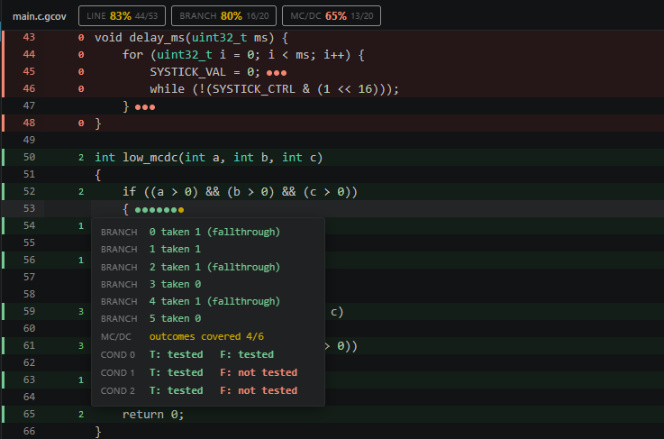

# GCov Coverage Viewer



A VS Code extension that renders `.c.gcov` files as a visual coverage report instead of raw text.

## Features

- **Line coverage** — covered lines highlighted green, uncovered red, non-executable lines unstyled
- **Execution counts** — how many times each line was executed, shown next to the line number
- **Branch coverage** — colored dots on each branch line showing which branches were taken
- **MC/DC coverage** — per-condition breakdown on hover showing which outcomes (true/false) were tested and which were not
- **Coverage summary bar** — line, branch and MC/DC percentages shown at the top of the file
- **Hover tooltips** — branch and MC/DC details on hover, styled like VS Code's native hover widget
- **Theme aware** — uses VS Code CSS variables, works with any light or dark theme

## Usage

Open any `.gcov` file generated by `gcov -b -c -g` and the viewer activates automatically.

To generate a `.gcov` file with full branch and MC/DC data:

```sh
gcov -b -c -g --object-directory <build_dir> <source_file.c>
```

## Requirements

- GCC with gcov support (`arm-none-eabi-gcov` or standard `gcov`)
- Compile with `-fprofile-arcs -ftest-coverage --coverage`
- Run `gcov` with `-b -c -g` flags to get branch and MC/DC data
